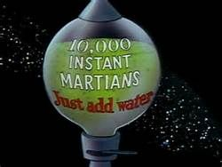

# Just Add Water



## Instant Cloud Scale, No Matter What You Deploy

Just Add Water (jaw) is a template repo designed to Securely and Reliably deploy any and all of your services with no additional effort from you.  By offloading provisioning and initial deployments here, it is possible to build an environment where a [Homogenous Infrastructure](link) requires no additional work.  This approach promotes management, maintainability, and security to be first class citizens in a codebase without distracting from important application features.

## Reliable Automation

jaw applies DevOps best practices to ensure that take you to production with confidence.

## Secure By Design

jaw applies defense in depth to existing codebases to establish a secure baseline and improve your security posture with every deployment.

## Dependencies

\# TODO: move to requirements

We ship jaw in a VSCode dev container.  This means you only need to install the following:

- Docker

- VSCode

- [Remote Containers Extension](https://marketplace.visualstudio.com/items?itemName=ms-vscode-remote.remote-containers)

You can then just do `code .` in the top level of this repo and follow VSCode's prompts to get a clean environment.  The first time you do this will take a couple
minutes while it builds your environment.

If you would prefer a purely native environment, you can install the following dependencies:

- [az cli](https://docs.microsoft.com/en-us/cli/azure/install-azure-cli?view=azure-cli-latest)

- [Terraform](https://www.terraform.io/downloads.html)

- kubectl - `az aks install-cli`

### Structure

This repo contains a full model of a web application spanning multiple services, compliance zones, and flighted versions.

#### Model files

- `apps` - declarations of apps that must be present on our clusters
- `clusters` - declarations of clusters
- `kubernetes` - templates for Kubernetes resources
- `requirements` - declarations of system requirements
- `terraform` - declarations of cloud resources
- `water.json` - global configuration of the 

#### Other folders

- `.*` - files internal to `just-add-water` (do not modify these)
- `jawctl.psd1` - PowerShell module for modifying the model.  Import into your terminal with `Import-Module ./jawctl.psd1`.

### Applying configurations

#### Declarative PowerShell with Requirements
All user-modifiable code in `just-add-water` is declarative--the ideal paradigm for declaring infrastructure resources and configuration.  For cloud resources, we can easily put these declartions in terraform templates; however, for more unique requirements, like installation of a CLI, we use the [`Requirements`](https://github.com/microsoft/Requirements) PowerShell framework.

Requirements consist of an optional "Test" condition and an optional "Set" script that together are used to implement idempotency.  A Requirement with a Test but not Set can be used for validation; a Requirement with a Set but not Test must have an idempotent Set script as it will be called in every application.

#### Declaring and applying Requirements
Requirements are kept in `/requirements`.  Each script is an individual Requirement that can be applied, though should only be applied if you know what you are doing.  The `Invoke-Checklist` script is provided inside our `./jawctl.psd1` module for applying requirements.

```powershell
Import-Module ./jawctl.psd1
```

To experiment running a Requirment set, try applying the `validate` requirements, which have no side effects--

```powershell
Invoke-Checklist -Name validate
```

To apply a full system configuration with staged rollout, run--

```powershell
Invoke-Checklist -Name system
```

If you're modifying your model, you may wish to experimentally test the model before applying it to your full system.  You can limit the effects of your changes to the "dev" ring by passing it into the filtering parameters supported by our `system` Requirements script:

```powershell
Invoke-Checklist -Name system -Parameters @{Ring = "dev"}
```
