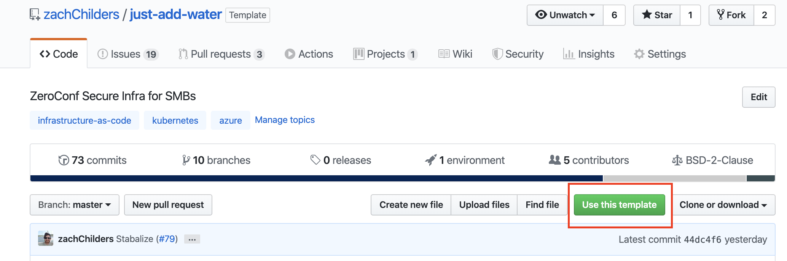
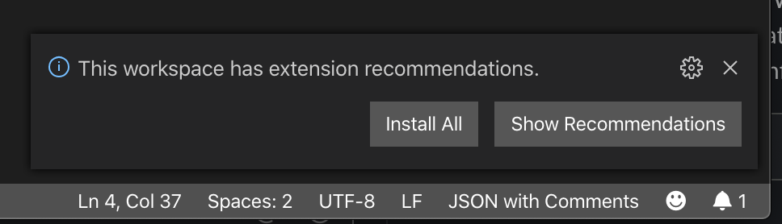
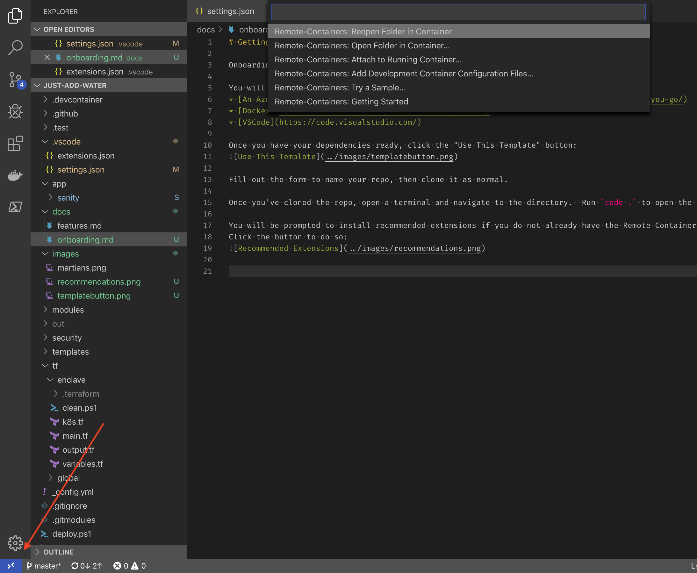
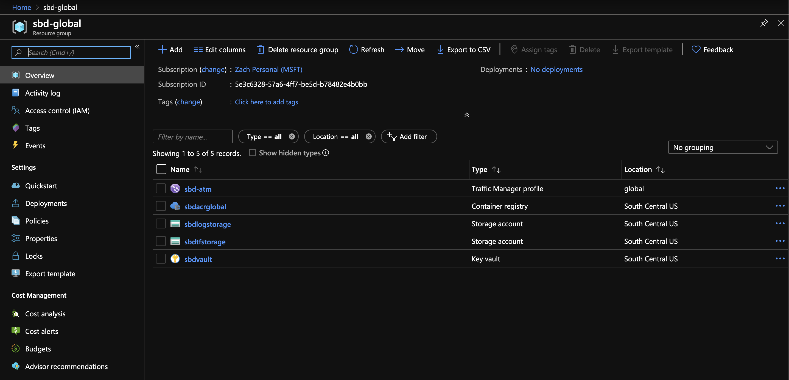

# Getting Started

Onboarding is very straightforward and shouldn't require a lot of effort:

## Prereqs

You will need:

* [An Azure Subscription](https://azure.microsoft.com/en-us/pricing/purchase-options/pay-as-you-go/)
* [Docker](https://www.docker.com/products/docker-desktop)
* [VSCode](https://code.visualstudio.com/)

Once you have your dependencies ready, click the "Use This Template" button:

Fill out the form to name your repo, then clone it.

## Install

Once you've cloned the repo, open a terminal and navigate to the directory.  Run
`code .` to open the repo in VSCode.

You will be prompted to install recommended extensions if you do not already have
the Remote Containers extension installed.
Click the button to do so:

You should now be prompted to reopen the repo in a container - if you are not,
you can manually do so by clicking the blue button on the bottom left and then
selecting "Reopen Folder in Container" from the menu that pops up:

!!WARNING!!The initial container opening can take up to 15 minutes.  We're
working to get this down.

## Initial Provision

The first time you use your Azure Subscription, you need to run `init.ps1` in
the Integrated Shell.  This script will create a centralized resource group
with some infrastructure we use to bootstrap other infrastructure later.

Running this script will prompt you for your Azure credentials and then run a
deployment that should take about 10 minutes.  After installation, if you look at the Azure portal
 these resources should be installed:

For a complete explanation of the infrastructure we provision, see our [infra guide](./infrastructure.md).

## Customization

At this point, you can begin building your services.  You can add any dockerized
application to the `app` folder, and we'll securely deploy it for you.
We suggest using applications from [our organization](https://github.com/mics-sbd),
which have all been hardened for you.  If you have a custom app or we're missing one
you need, you are able to simply add a subfolder with what you're looking for.

We create a seperate container for each dockerfile in each subfolder, and
will automatically deploy it.  We recommend adding folders as git submodules,
which will let you version them separately from your main infrastructure codebase.
For a complete explanation of our docker discovery and usage, see our [docker guide](./docker.md).

## Deployment

Once you are satisfied with your configuration, it's time to deploy.  Simply run
`deploy.ps1` and go grab a cup of coffee!  You can expect this process to take
at least 15 minutes, but potentially much longer if you're using large custom docker images.

When this script is done, you're up and running!  Push your copy of the repo to whatever
Git storage your organization uses, then feel free to tell your boss what a great job you
did securing the company!  Nice work, hero!

## Next Steps

There are additional steps you can take to further secure your infrastructure.  Please visit
our [next steps suggestion guide](nextsteps.md) for details.
